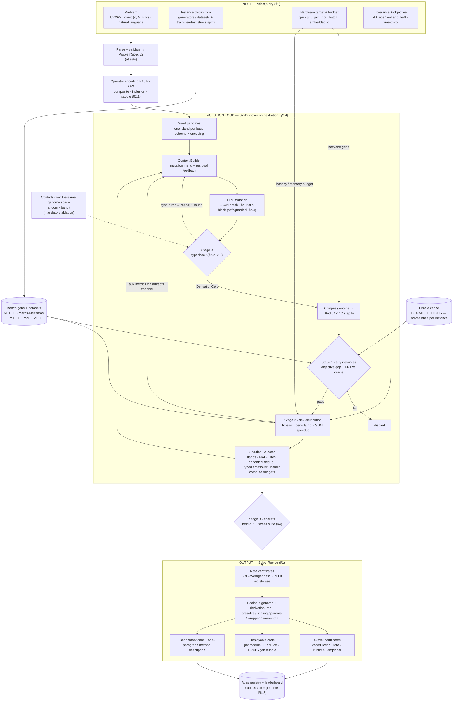

# Optimization Atlas v2 — Operator-Typed Solver Synthesis + Benchmark
**Rev 3 · Aug 2026 · full build committed**

**Current submission scope, September 6, 2026:** the user approved the
[ICLR attack plan](../docs/ICLR_SUBMISSION_ATTACK_PLAN.md). Its
[claim ledger](../docs/ICLR_CLAIM_LEDGER.md) and
[development protocol](../docs/SOLVER_INTERACTION_PROTOCOL.md) supersede the
aspirational implementation and paper claims below. The full derivation engine,
SRG/PEP certificate layer and public leaderboard remain outside the current
submission evidence. Hardware remains part of the paper. Joint-search and LLM
advantages require controlled results.

The [current paper end goal and remaining milestones](../docs/ICLR_PAPER_ENDGAME.md)
summarize the intended title, contributions, final controls and benchmark scope.
Use that status alongside the attack plan rather than interpreting the Rev 3
wish list below as completed work.

Rev 2 changes: engine decision finalized (SkyDiscover orchestration, OpenEvolve as second backend), problem-class coverage ladder added (§2.6), demonstration domains fixed (§4.2), intro contributions written (§5.1), a reviewer-facing related-work & competitor-obligations section (§5.2), venue & spotlight strategy added (§5.3) including the named **rediscovery experiment E-R**, and a complete file-level repo blueprint (§3), and an end-to-end flow diagram (§9).

Rev 3 changes: **signal-processing/imaging wing added** (§4.2–§4.3) — real-data problem slate (lasso/rcv1, TV/BSD500, nuclear-norm matrix completion/MovieLens, robust PCA) folded into the cells; **OCT medical imaging promoted to flagship domain narrative** (§4.2) with the deterministic-non-ML-solver motivation; phase retrieval added as the fenced nonconvex appendix experiment **E-R2** (§4.4); coverage ladder extended with nuclear-norm prox and complex-valued Hilbert spaces (§2.6); ℓ0 pruning considered and rejected. Convex-only headline claims unchanged.

---

## 0. Thesis

**One sentence:** Atlas maps `(problem class, instance distribution, hardware target, budget)` → a complete, certificate-carrying solver recipe, by evolving programs in a **typed operator calculus** (Ryu–Yin, *Large-Scale Convex Optimization*) — so every candidate the search produces is **convergent by construction**, and LLM creativity is spent only where it's safe: structure choice, metrics, and heuristic schedules behind safeguards.

**From v1:** the four hand-picked LP families become one operator IR whose method zoo is *generated*; raw-Python mutation becomes typed-genome mutation; x-distance correctness becomes objective-gap + KKT correctness; aspirational OTTER becomes a four-level certificate stack; the deadline paper becomes a system + public benchmark.

**Why the operator view (grounded in the book's chapters):** Ch. 2 = atom algebra (monotone/averaged operators, resolvents, KM iteration, splitting, variable metric). Ch. 3/8/9 = five *derivation techniques* (infimal postcomposition, dualization, variable metric, Gaussian elimination, linearization) + ADMM machinery + duality — i.e., **genome mutation operators with proofs attached**; PDHG, Condat–Vũ, PD3O, ADMM variants all fall out. Ch. 12 = wrappers (acceleration, Halpern/optimized-Halpern — the exact trick behind HPR-LP/cuPDLPx). Ch. 13 = scaled relative graphs, an implementable automatic averagedness/contraction certifier. Ch. 4–6/11 = execution models for the hardware axis. The GPU-LP community is hand-evolving this space one arXiv paper at a time (PDLP → cuPDLP → cuPDLP-C → cuPDLPx → HPR-LP → MPAX, each = "PDHG + {restart | reflection | Halpern | PID weight}"); Atlas automates that search, with certificates, per problem class and hardware target.

---

## 1. Product spec (the contract)

### Input: `AtlasQuery`
```yaml
problem:            # any ONE of:
  cvxpy: <program>          # preferred structured entry
  conic: {c, A, b, cones}   # standard conic data
  nl: "<natural language>"  # parsed to ProblemSpec (v1 pipeline, kept)
instances:
  generator: <name|code>    # parameterized sampler OR dataset ref
  splits: {train: 60, dev: 20, test: 20, stress: auto}
target:
  hardware: cpu | gpu_jax | gpu_batch | embedded_c
  budget: {latency_ms: 5, memory_mb: 512}     # optional hard constraints
  tolerance: {kkt_eps: 1e-4, cert: [gap, pfeas, dfeas]}
objective: time_to_tol | robust_time | energy | iters
```

### Output: `SolverRecipe`
```yaml
recipe:
  encoding: composite | inclusion | saddle | dual
  genome: <typed operator program — §3.4>
  derivation: <proof tree: base scheme + moves + side conditions>
  presolve / scaling / params / wrapper / warm_start / backend: ...
certificates:
  construction: <type-check log: T is α-averaged / ρ-contractive under region R>
  rate: <SRG/PEP numeric worst-case bound, when computable>
  runtime: <fixed-point residual, KKT residuals, gap, infeasibility detection>
  empirical: <held-out benchmark card: SGM speedup, failure rate, stress results>
code: {jax_module, c_source?, cvxpygen_bundle?}
report: <benchmark card + one-paragraph method description>
```

**Design invariant (the moat):** nothing enters the Atlas registry without all four certificate levels populated (rate may be "not computed" for exotic compositions; construction + runtime + empirical are mandatory).

---

## 2. Core design: the operator IR and typed genome

### 2.1 Problem IR — three interchangeable encodings
- **E1 composite:** `min f(x) + g(x) + h(Lx)` — f smooth (L_f, maybe μ), g/h prox-friendly, L linear.
- **E2 monotone inclusion:** `0 ∈ A(x) + B(x) + C(x)` — A maximal monotone (resolvent), B β-cocoercive, C monotone Lipschitz (skew/linear).
- **E3 saddle:** `min_x max_y f(x) + <Lx,y> − h*(y)` → product-space inclusion with skew operator.

LP/QP/conic map in canonically. Encoding choice is a genome gene (dualization / Attouch–Théra included).

### 2.2 Atoms and the property lattice (the type system)
Atoms: `grad(f)`, `prox(γ,g)` (= `J_{γ∂g}`), `proj(C)`, `reflect = 2J−I`, `linear(K)`, `adjoint(K)`, `metric(M≻0)`, `affine_solve`, `identity`, `avg(λ;·,·)`.
Properties tracked symbolically-or-numerically: `monotone`, `maximal`, `μ-strong`, `L-Lipschitz`, `β-cocoercive`, `nonexpansive`, `α-averaged`, `ρ-contractive`, `firmly-nonexpansive`.
Representative typing rules (each cites its LSCOMO section): prox is (1/2)-averaged; L-smooth convex ⇒ grad is (1/L)-cocoercive; **FBS** `prox(γ,A)∘(I−γB)` averaged for γ∈(0,2β); **DRS** `½(I + R_{γA}R_{γB})` (1/2)-averaged; **DYS** averaged under its side condition; compositions/convex-combinations of averaged operators are averaged with computable coefficients; **KM** converges for averaged T; strong monotonicity ⇒ ρ-contraction ⇒ linear rate; **Halpern** anchor gives O(1/k) fixed-point residual for nonexpansive T.

### 2.3 Derivation moves = certified structural mutations
Genome records a **derivation tree**: `base ∈ {PPM, FBS, BFS, DRS, DYS, FLiP-ADMM}` plus `moves ∈ {dualize, infimal_postcompose, variable_metric(M), gauss_eliminate(block), linearize(term)}`, each with checker-enforced side conditions. Golden identities as unit tests: ADMM = DRS-on-dual; PDHG = DRS/PPM under metric + elimination; Condat–Vũ/PD3O via linearization. If the engine re-derives the zoo, the search space is exactly "all methods this book can prove."

### 2.4 Free-form creativity behind safeguards
Adaptive stepsizes, restart triggers, primal-weight controllers, warm-start predictors live in `HEURISTIC` blocks the LLM writes as raw code, wrapped by a **safeguard monitor**: parameters may only move inside the certified region; non-certified actions accepted only if the fixed-point/KKT residual doesn't increase over a window, else fall back to the certified default. Safeguarded iteration inherits the fallback's convergence (stated as a lemma). **Structure is typed, schedules are safeguarded, nothing is unverified.**

### 2.5 Certificates, cheapest-first
1. **Construction (static, μs):** type-check the derivation; emit constants + rule citations.
2. **Rate (seconds, finalists):** SRG averagedness/contraction calculator; PEPit numeric worst-case over N steps (PEP used as *certifier*, not designer).
3. **Runtime (per solve):** ‖x−Tx‖, primal/dual feasibility, gap, infeasibility certificates.
4. **Empirical (per recipe):** held-out + stress benchmark card (§4).
Stretch: Lean-formalize level 1 (~15 lemmas + KM) so derivation certs are machine-checked — the honest, tractable version of v1's OTTER.

### 2.6 Problem-class coverage ladder (what Atlas can solve)
The gate is prox/projection availability.
- **v0.1, full guarantees:** **LP**; **convex QP** (quadratic prox = one linear solve; factorization cached or CG on GPU); **composite ML** — lasso/elastic-net/group-sparsity, logistic, Huber, TV, constrained least squares (FBS/DYS/Condat–Vũ islands).
- **v0.1, low-rank family:** **nuclear-norm problems** — matrix completion `min ½‖P_Ω(X−R)‖² + λ‖X‖_*` and robust PCA `min ‖L‖_* + λ‖S‖₁ s.t. L+S=M`. One new atom, `prox_nuclear` (singular-value thresholding); deliberately the first *expensive-prox* atom, exercising the cost model and the FLOP MAP-Elites dimension. (The Burer–Monteiro `WHᵀ` factorized form is nonconvex and stays out; the convex form is the benchmark problem.)
- **v0.2:** **SOCP** — SOC projection is closed-form, so it is *one new atom*; covers robust LS/MPC and convex QCQP via SOC representation. **Exponential cone** (entropy, GP, logistic-as-conic) via 1-D Newton projection, SCS-style. **Complex-valued signals** — monotone operator theory lives in any real Hilbert space, so ℂⁿ ≅ ℝ²ⁿ with `⟨x,y⟩ = Re⟨x,y⟩_ℂ` carries every typing rule over unchanged; engineering cost is Wirtinger gradients + complex dtype support in the atoms. Target: complex OCT reconstruction/denoising (§4.2) — a niche with essentially no existing solver-synthesis occupants.
- **Roadmap, not promised:** **SDP** (projection = eigendecomposition; in-frame but expensive).
- **Ceiling claim for the intro:** the IR is monotone inclusions, so convex-concave saddle problems and monotone variational inequalities (games, robust reformulations) come along for free.
- **Explicitly out of the claims:** nonconvex; integer (MIP appears only via LP relaxations as data). One deliberate, fenced exception exists as an *appendix experiment*, not a cell: phase retrieval (E-R2, §4.4), run with construction/rate certificates explicitly marked "not applicable — nonconvex region" and only runtime + empirical levels live. The fence is the point: it demonstrates the genome space degrades gracefully outside the certified region rather than pretending the region covers it. Headline claims remain convex-only.

---

## 3. Repository blueprint (file-level)

Package name `optimization-atlas`, import name `atlas`. Vendored `openevolve/` kept as-is; **SkyDiscover is a pinned pip dependency, not vendored**. Every file below carries a phase tag: the phase in which it must first exist ([P0]–[P4], see §6).

### 3.1 Engine decision (recorded)
**SkyDiscover is the orchestration layer.** Its four programmable components — Context Builder / Solution Generator / Evaluator / Solution Selector — map 1:1 onto Atlas: Stage-0 typechecker → Evaluator stage; mutation menu → Context Builder; canonical-genome dedup + typed crossover → Solution Selector. Its AdaEvolve (bandit-scheduled islands, adaptive exploration, meta-guidance on stall) and EvoX (meta-evolving the search strategy) report beating OpenEvolve/GEPA/ShinkaEvolve under fixed 100-generation budgets (~24% mean / 34% median over OpenEvolve on 172 Frontier-CS tasks; matching/exceeding AlphaEvolve on 6/8 math and 6/6 systems tasks) — self-reported, but the margins are large and the architecture argument stands alone. Its `search=` switch (openevolve/gepa/shinkaevolve selectable) gives the engine-agnosticism ablation for free, and AdaEvolve's bandit island allocation is the per-family budget mechanism we wanted anyway. The vendored OpenEvolve remains the second `SearchBackend` (continuity + ablation). Skipped: LoongFlow-style agentic planners — their complexity approximates the pruning our type system does exactly. Cherry-picked later: EvoTune/Kevin-style RL fine-tuning of the mutation model (stretch track).
**Adjacency note:** SkyDiscover's own showcase evolves DeepSeek's EPLB *heuristic* (vLLM) to 14% better balance. Our MoE cell must state the differentiation: they evolve the heuristic packing algorithm; we synthesize the certified LP solver for the LPLB-style per-batch optimization layer beneath it.

### 3.2 Tree (≈135 tracked files at P4-complete; ≈50 by end of P1)

```
optimization-atlas/
├── README.md                       # quickstart, one-figure pitch            [P0]
├── DESIGN.md                       # frozen decisions (this plan distilled)  [P0]
├── LICENSE                         # Apache-2.0                              [P0]
├── pyproject.toml                  # deps incl. pinned skydiscover, jax      [P0]
├── Makefile                        # test / lint / bench / cards targets     [P0]
├── .github/workflows/
│   ├── ci.yml                      # unit + golden + property tests         [P0]
│   └── bench-nightly.yml           # small-cell nightly regression          [P3]
├── configs/
│   ├── atlas_default.yaml          # global knobs (tolerances, budgets)     [P0]
│   ├── engines/                    # skydiscover.yaml, openevolve.yaml,
│   │                               # random.yaml, bandit.yaml (4 files)     [P2]
│   ├── cells/                      # one yaml per benchmark cell (10 files):
│   │                               # lp_netflow_gpu, lp_general_cpu,
│   │                               # qp_mpc_embedded, composite_ml_gpu,
│   │                               # lp_moe_balance, nl_frontend,
│   │                               # tv_imaging_gpu, lowrank_gpu,
│   │                               # socp_acopf (v0.2),
│   │                               # oct_complex (v0.2, data-contingent)   [P2–P4]
│   └── llm/router.yaml             # cheap-model/strong-model routing       [P2]
├── atlas/
│   ├── __init__.py  ·  cli.py      # `atlas run/bench/submit` entrypoints   [P0]
│   ├── ir/                         # 6 files
│   │   ├── spec.py                 # ProblemSpec v2, BlockRef, StructureTags[P0]
│   │   ├── encodings.py            # E1↔E2↔E3 transforms, conic mapping    [P0]
│   │   ├── parse_cvxpy.py          # CVXPY → spec                           [P1]
│   │   ├── parse_nl.py             # NL → spec (v1 parser ported)           [P2]
│   │   └── validate.py             # dims, witnesses, m≤n etc.              [P0]
│   ├── operators/                  # 7 files
│   │   ├── base.py                 # Atom protocol, PropSet, CostModel      [P0]
│   │   ├── prox.py                 # box/simplex/affine/quadratic/l1/l2/
│   │   │                           # huber/TV proxes [P0];
│   │   │                           # nuclear (SVT) [P3]; complex dtype [P4]
│   │   ├── cones.py                # orthant, SOC [P4], exp-cone stub
│   │   ├── linear.py               # sparse/dense ops + adjoints            [P0]
│   │   ├── metrics.py              # diagonal/block metrics, Ruiz           [P0]
│   │   └── registry.py             # name → atom lookup for genomes         [P1]
│   ├── typing_/                    # 5 files (underscore: stdlib clash)
│   │   ├── props.py                # property lattice + constants algebra   [P1]
│   │   ├── rules.py                # rule table w/ LSCOMO citations         [P1]
│   │   ├── check.py                # typecheck(genome,spec)→DerivationCert  [P1]
│   │   └── certs.py                # cert dataclasses + serialization       [P1]
│   ├── schemes/                    # 5 files
│   │   ├── base_schemes.py         # PPM/FBS/BFS/DRS/DYS/FLiP-ADMM          [P0]
│   │   ├── moves.py                # the five derivation moves              [P1]
│   │   ├── derive.py               # derivation-tree engine                 [P1]
│   │   └── zoo.py                  # golden genomes (ADMM, PDHG, CV, PD3O…) [P1]
│   ├── wrappers/                   # 5 files
│   │   ├── km.py                   # KM loop                                [P0]
│   │   ├── halpern.py              # anchor schedules incl. optimized       [P1]
│   │   ├── momentum.py             # Nesterov-style, validity-gated         [P3]
│   │   └── restart.py              # residual/KKT triggers (safeguarded)    [P2]
│   ├── safeguard/monitor.py        # region clamp + residual-descent accept
│   │                               # + certified fallback (2 files)         [P2]
│   ├── genome/                     # 5 files
│   │   ├── schema.py               # pydantic/JSON schema                   [P1]
│   │   ├── canonical.py            # canonical serialization + hash (dedup) [P2]
│   │   ├── patch.py                # JSON-patch apply/validate (LLM format) [P2]
│   │   └── crossover.py            # typed subtree swap                     [P3]
│   ├── compile/                    # 5 files
│   │   ├── jaxc.py                 # genome → jitted step fn (+vmap batch)  [P0]
│   │   ├── numpyc.py               # reference backend                      [P0]
│   │   ├── cgen.py                 # embedded-C emitter                     [P4]
│   │   └── cost.py                 # flop/memory model per compiled step    [P2]
│   ├── certify/                    # 5 files
│   │   ├── residuals.py            # KKT / fixed-point / gap / infeas       [P0]
│   │   ├── srg.py                  # SRG averagedness calculator            [P3]
│   │   ├── pep.py                  # PEPit driver for finalists             [P3]
│   │   └── card.py                 # benchmark-card assembly                [P3]
│   ├── evolve/                     # 8 py + 4 prompt templates
│   │   ├── backend.py              # SearchBackend protocol                 [P0]
│   │   ├── sky_adapter.py          # SkyDiscover 4-component impls          [P2]
│   │   ├── oe_adapter.py           # OpenEvolve adapter (vendored engine)   [P2]
│   │   ├── controls.py             # random + bandit search, same space     [P2]
│   │   ├── seeds.py                # per-island seed genomes                [P2]
│   │   ├── evaluator.py            # Stage 0–3 cascade                      [P2]
│   │   ├── feedback.py             # aux-metrics → prompt artifacts         [P2]
│   │   └── prompts/                # system.md, mutation_menu.md,
│   │                               # repair.md, heuristic_block.md          [P2]
│   ├── bench/                      # 21 files
│   │   ├── metrics.py              # SGM-10, profiles, tol-matched termina- [P0]
│   │   ├── runner.py               # cell runner, repeats, oracle cache     [P1]
│   │   ├── oracles.py              # CLARABEL/HiGHS/OSQP/SCS wrappers       [P0]
│   │   ├── baselines.py            # tuned family defaults per cell         [P2]
│   │   ├── stress.py               # conditioning/degeneracy/infeas suite   [P3]
│   │   ├── gens/                   # lp_random [P0], mpc_battery [P0],
│   │   │                           # netflow [P1], multicommodity [P2],
│   │   │                           # lasso_logistic [P2], tv_denoise [P3],
│   │   │                           # nuclear_mc [P3], robust_pca [P3],
│   │   │                           # phase_retrieval [P5, E-R2 only],
│   │   │                           # moe_balance [P4], dc_opf [P4],
│   │   │                           # acopf_socp [P4] (13 files)
│   │   └── datasets/               # netlib [P1], maros_meszaros [P1],
│   │                               # miplib_relax [P2], miplib_nl [P2],
│   │                               # rcv1 [P2], bsd500 [P3],
│   │                               # kermany_oct [P3] (local copy at
│   │                               # v2/data/kermany2017_oct),
│   │                               # movielens_100k [P3], pglib [P4]
│   │                               # fetchers w/ checksums (10)
│   ├── registry/                   # 4 files
│   │   ├── store.py                # results DB (sqlite + parquet)          [P3]
│   │   ├── leaderboard.py          # static-site generator                  [P4]
│   │   └── submit.py               # submission-as-genome CI entry          [P4]
│   └── utils/                      # logging.py, seeding.py, io.py (4)      [P0]
├── minimal/                        # v1 gold refs + tests, kept (4 files)   [P0]
├── openevolve/                     # vendored, unchanged
├── tests/                          # 10 files: test_props, test_rules_golden
│   │                               # (zoo re-derivation!), test_prox_property
│   │                               # _based (vs CVXPY), test_compile_equiv,
│   │                               # test_safeguard, test_genome_patch,
│   │                               # test_evaluator_cascade, test_metrics,
│   │                               # test_gens, test_e2e_smoke      [P0–P2]
├── scripts/                        # fetch_data.sh, run_cell.py,
│   │                               # run_ablation.py, run_rediscovery.py,
│   │                               # export_leaderboard.py (5)      [P1–P4]
├── site/                           # leaderboard templates (~3 files)       [P4]
└── docs/                           # plan.md (this), genome_schema.md,
                                    # rules_table.md, benchmark_protocol.md,
                                    # contributing.md (5)             [P1–P4]
```

**Counts:** `atlas/` ≈ 88 (84 py + 4 prompt md) · tests 10 · scripts 5 · configs 13 · docs 5 · site ~3 · root+CI 7 · minimal 4 → **≈135 files** at P4-complete, ≈100 of them Python. End of P1 ≈ 50 files (everything tagged [P0]/[P1]).

### 3.3 The genome (what the LLM mutates)
```json
{
  "encoding": "saddle",
  "blocks": {"f": "quad:P", "g": "box", "h*": "cone_dual:K", "L": "A"},
  "derivation": {"base": "DRS",
                 "moves": [["dualize","fenchel"],
                            ["variable_metric",{"M":"block_diag(tau,sigma)"}],
                            ["gauss_eliminate","y"]]},
  "params": {"tau":"1/(ruiz_colnorm)","sigma":"1/(ruiz_rownorm)","lambda":1.0},
  "wrapper": {"anchor":"halpern_opt","restart":{"on":"kkt_ratio>0.5","safeguarded":true}},
  "presolve": ["singleton_rows","fixed_vars"], "scaling":"ruiz",
  "warm_start":"prev_instance",
  "backend": {"target":"gpu_jax","precision":"f64","batch":32},
  "heuristic_blocks": {"stepsize_ctl":"<python, runs under safeguard>"}
}
```
Mutation menu offered in prompts: swap base; apply/remove a move; reassign blocks (which term is f/g/h∘L); change metric family; toggle wrapper/restart; edit params; rewrite a heuristic block; change presolve/scaling/warm-start/backend genes. LLM replies with a **JSON patch** or a heuristic-block rewrite; both validated before any execution. Structured genomes buy two things raw-code evolution can't do reliably: **exact dedup** (canonical hash) and **well-defined crossover** (typed subtree swap that must re-typecheck).

### 3.4 The loop
- **Islands:** one per base scheme × encoding; AdaEvolve's bandit scheduler allocates compute across islands (replaces v1's per-seed controllers, same isolation insight).
- **Cascade:** Stage 0 static typecheck (free; type errors routed back as repair feedback, one round, then fall back to parent) → Stage 1 tiny instances (objective gap + KKT vs cached oracle, NaN/divergence guards) → Stage 2 dev distribution (fitness + aux metrics via artifacts channel) → Stage 3 finalists (held-out + stress + SRG/PEP certs + hardware profile).
- **Fitness:** `1[all certs pass] · SGM10-speedup(time-to-kkt_eps vs cell baseline)`, robustness tie-break. Clamp semantics survive from v1; iteration counts never compared across schemes.
- **MAP-Elites dims:** per-iter FLOP class, memory class, #derivation-moves — "simple enough to explain in a paragraph" is a *dimension*, not a filter.
- **Controls baked in:** random and bandit search over the identical genome space, same budget — the "does the LLM add anything" ablation, mandatory.

---

## 4. Evaluation protocol and the Atlas benchmark

### 4.1 Metrics and comparison rules (fixed once)
Primary: **time-to-tolerance** at kkt_eps ∈ {1e-4, 1e-8} (first-order methods shine at the former, get honest at the latter — report both), as **shifted geometric mean (SGM-10)** vs the cell's reference baseline. Secondary: Dolan–Moré profiles, failure rate, memory high-water, iterations (within-scheme only). Fairness: identical KKT residual definitions for every solver; presolve on-for-all or off-for-all per table; JAX-vs-C++ numbers flagged cross-ecosystem, with the defended claim being within-ecosystem (evolved-JAX vs reference-JAX seeds). Every number: fixed seeds, N≥3 repeats, dispersion shown, env lockfile + container digest per row.

### 4.2 Demonstration domains: four anchors riding the LP→QP→SOCP ladder
- **Imaging/medical — the flagship domain narrative (added Rev 3).** The story the other domains lack: *why would a practitioner insist on a certified solver over a learned model?* Medical imaging answers it. Clinicians distrust ML denoisers precisely because a network can hallucinate away pathology; **OCT (optical coherence tomography) denoising** is done in practice both with ML and classically, and the med-imaging community actively prefers deterministic methods for exactly this reason. Atlas's pitch made concrete: an **LLM-synthesized but deterministic, certificate-carrying, non-learned solver** — best of both worlds, and the intro paragraph writes itself. Execution in two stages: (1) *now* — TV denoising as a full cell on **BSD500** (natural images) + **Kermany2017 OCT B-scans** (real clinical retinal images; grayscale processed exports, treated as real-valued). This is PDHG/Condat–Vũ home turf — `h(Lx)` with L = discrete gradient — and produces the one figure a reviewer can evaluate in two seconds. (2) *v0.2, data-contingent* — **complex-valued OCT reconstruction**: raw OCT interferograms are complex after Fourier processing (phase is discarded before datasets like Kermany are published), so the complex claim requires genuinely complex data (raw/swept-source captures, or honestly-labeled synthetic complexification of magnitude images). If secured, "certified solver synthesis over complex-valued signals" is a differentiator with essentially zero occupants (§2.6). **Do not hang the complex claim on Kermany** — it is almost certainly 8-bit grayscale JPEG.
- **Energy/control:** battery + load-smoothing MPC (QP, embedded target with latency budget); DC-OPF (LP/QP on grid cases); v0.2 SOCP flagship = **AC-OPF second-order-cone relaxation on PGLib-OPF** — new class and deeper energy story in one move.
- **Networks:** min-cost / multicommodity flow on GPU; the **MoE-balancing microsecond cell** (LPLB-style per-batch LPs from cube/hypercube/torus replica topologies + skewed loads; warm-start axis is live because it re-solves every batch). Differentiation vs SkyDiscover's EPLB showcase stated explicitly (§3.1).
- **ML-at-scale:** batched lasso/logistic on GPU (vmap backend; MPAX-adjacent batch story) — now on **real data** (rcv1) as well as synthetic; plus the low-rank pair (nuclear-norm matrix completion on MovieLens-100k, robust PCA on surveillance video), the classic signal-processing convex quartet.
- **External validity suites:** NETLIB, Maros–Mészáros, MIPLIB-2017 LP relaxations; MIPLIB-NL front-end on a **separate scoreboard** so parser quality never contaminates solver results.

**Scope guardrail (Rev 3):** the imaging/SP wing is a *wing*, not a new center of gravity — the spotlight case (E-R, HPR-LP comparison) lives in the LP/QP cells and those are never deprioritized for it. Considered and rejected for the slate: ℓ0-constrained network pruning (no certifiable prox structure, drags toward "another ML training paper"); Burer–Monteiro matrix factorization (nonconvex; superseded by the nuclear-norm form).

### 4.3 Cells v0.1 (+ v0.2)
1. **lp_netflow_gpu** — flow generators, 1e5–1e7 nnz; baselines: PDHG default seed, SCS/HiGHS reference, cuPDLP-class external line where licensing allows.
2. **lp_general_cpu** — NETLIB + MIPLIB relaxations; the degeneracy torture set that makes objective-gap correctness non-negotiable.
3. **qp_mpc_embedded** — battery/peak-shaving/load-smoothing gens + Maros–Mészáros; latency-budgeted; baselines OSQP + reference DRS/ADMM seeds.
4. **composite_ml_gpu** — lasso/huber/logistic, batch mode; synthetic **+ rcv1** (the standard large-sparse real-data lasso/logistic benchmark — the external-validity upgrade this cell lacked).
5. **lp_moe_balance** — microsecond budget, warm starts.
6. **nl_frontend** — MIPLIB-NL through parser → same pipeline, separate scoreboard.
7. **tv_imaging_gpu** *(Rev 3)* — TV denoising `min ½‖x−y‖² + λ‖∇x‖₁` on **BSD500** (natural) + **Kermany2017 OCT B-scans** (clinical, real-valued; local copy at `v2/data/kermany2017_oct/`); the cleanest `h(Lx)` cell — PDHG/Condat–Vũ/PD3O home turf and the paper's visual figure; baselines: Chambolle–Pock reference, tuned PDHG seed.
8. **lowrank_gpu** *(Rev 3)* — the convex low-rank pair: nuclear-norm matrix completion on **MovieLens-100k** and robust PCA (`‖L‖_* + λ‖S‖₁, L+S=M`) on surveillance-video background subtraction; one new atom (`prox_nuclear`/SVT), first expensive-prox cell, stresses the cost model; baselines: SVT/ALM references, DRS/ADMM seeds.
9. *(v0.2)* **socp_acopf** — PGLib-OPF SOC relaxations + robust-MPC SOC variants; one new cone atom, no new machinery.
10. *(v0.2, data-contingent)* **oct_complex** — complex-valued OCT reconstruction per §4.2; requires genuinely complex data (raw/swept-source interferograms or labeled synthetic complexification); ℂⁿ ≅ ℝ²ⁿ embedding per §2.6, Wirtinger gradients, complex atoms.

### 4.4 Named experiments E-R and E-R2 (the rediscovery runs)
**E-R (headline).** Start islands from **vanilla PDHG only** on cells 1–2; log the order in which evolution introduces adaptive restart, reflection, Halpern anchoring, and adaptive primal-weight control; compare against the literature timeline (PDLP 2021 → cuPDLP 2023 → restarted-Halpern 2024 → cuPDLPx/HPR-LP 2025). Deliverable: a single "years-of-research-per-generation" figure — and, engineered-for: **a novel certified composition beyond the timeline that beats the HPR-LP-class baseline on cell 1** (rediscovery is the floor, not the result; §5.3). `scripts/run_rediscovery.py` is a first-class artifact, pre-registered before the run.

**E-R2 (appendix, fenced nonconvex — Rev 3).** Phase retrieval `min ‖|Ax|−b‖²` on synthetically-measured MNIST. The hook: **Fienup's hybrid input-output (HIO) — the workhorse of practical phase retrieval for 40 years — *is* Douglas–Rachford applied to a nonconvex feasibility problem** (and Gerchberg–Saxton is alternating projections). Run the *same genome space* with construction/rate certificates marked "not applicable — nonconvex region," runtime + empirical levels only, and ask whether evolution rediscovers HIO/RAAR-class iterations against that second, independent literature timeline. Strictly an appendix experiment: never a cell, never in headline claims, and its purpose is to show the space degrades gracefully outside the certified region (§2.6). Pre-registered alongside E-R.

### 4.5 Benchmark packaging
`atlas-bench` pip package: pinned-seed generators, checksummed fetchers, metric code, card renderer, CI harness re-running submissions in containers. **Submission = a genome** (+ optional heuristic blocks); harness compiles, typechecks, certifies, runs, publishes the card — no free-form binaries in v0.1; the typed genome *is* the reproducibility story. Versioned registry + static leaderboard; test-split seeds withheld and refreshed per version; code Apache-2.0, data per upstream licenses (verify NETLIB/MIPLIB/MM redistribution terms before release).

---

## 5. Paper plan

### 5.1 Intro contributions (as they'd appear)
1. **A typed operator calculus as a search space.** Convex problems compile to monotone inclusions; solvers are derivation trees over base splittings and five certified transformation moves (dualization, variable metric, elimination, linearization, postcomposition). Every reachable program is convergent by construction — the first LLM-evolution search space closed under correctness — with a safeguard lemma covering free-form heuristic schedules.
2. **Atlas, a certificate-gated synthesis system.** Distribution- and hardware-conditioned evolutionary search emitting code plus four certificate levels: type derivation, SRG/PEP worst-case rates, runtime KKT/fixed-point residuals, held-out benchmark cards.
3. **The Atlas benchmark.** Problem-class × distribution × hardware cells, tolerance-matched protocol, and a leaderboard where a submission *is* a genome — reproducibility as an artifact, not a statement.
4. **Findings.** The engine re-derives the known method zoo from five moves; discovered recipes beat tuned defaults across LP/QP/low-rank/imaging cells in energy, networks, ML infrastructure, and medical imaging — including real-data signal-processing classics (lasso/rcv1, TV denoising on clinical OCT, nuclear-norm completion, robust PCA); winning genomes diverge across hardware targets for identical distributions; and LLM-guided search outperforms random/bandit search over the same typed space. The medical-imaging cell carries the practitioner narrative: a deterministic, certificate-carrying, non-learned denoiser for clinical OCT, synthesized by an LLM but incapable of hallucinating away pathology — the case where "certified" is a user requirement, not a reviewer nicety.

### 5.2 Related work & competitor obligations (reviewer-facing)
Seven clusters. Each entry: who they are → our differentiation → **Obligation:** the concrete table/baseline/ablation reviewers will demand before believing us.

**A. LLM-driven evolutionary program synthesis** *(the crowd we'll be filed under).* FunSearch (Romera-Paredes et al., Nature '23); AlphaEvolve (Novikov et al. '25); OpenEvolve (Sharma '25); ShinkaEvolve (Lange et al. '25); GEPA (Agrawal et al. '25); AdaEvolve (Cemri et al. '26); EvoX + SkyDiscover (Liu et al. '26); ThetaEvolve / TTT-Discover (test-time-training loops); LoongFlow; TurboEvolve; CodeEvolve; EMO-STA (multi-task shared archives, '26); EvoTune (RL + evolution, '25); EoH / ReEvo / LLaMEA (combinatorial heuristics); Yu et al. '25 (evolved SAT solvers beating human-engineered systems — closest solver-design precedent); AutoEP (ICLR '26, feedback-grounded LLM algorithm control). Cautionary datum: an ICLR '26 workshop paper titled "Simple Baselines are Competitive with Code Evolution."
*Differentiation:* they mutate unverified code and rank by runtime-as-fitness; our space is typed (closed under convergence) and every survivor carries certificates. Islands/MAP-Elites are now table stakes — never claim them as novel. Structured genomes enable exact dedup and typed crossover, which raw-code systems cannot do reliably.
**Obligation:** same-budget engine comparison (OpenEvolve, ShinkaEvolve, AdaEvolve/EvoX via the `search=` switch); random + bandit controls over the identical genome space; the gate-survival-per-generation figure; explicit differentiation from SkyDiscover's EPLB showcase (heuristic layer vs certified-solver layer).

**B. Computer-assisted analysis & design of first-order methods (PEP line).** PEP (Drori & Teboulle '14); tight analyses + PEPit (Taylor et al.); OGM (Kim & Fessler); OptISTA; BnB-PEP (Das Gupta, Van Parys, Ryu, Math. Prog. '23: provably optimal fixed-step methods via global QCQP over smooth convex minimization; we make NO claim about its future-work section, which we have not verified); silver stepsizes (Altschuler & Parrilo); long-step GD (Grimmer). SRG (Ryu–Hannah–Yin) is our *tool*, cited as foundation.
*Differentiation:* they optimize coefficients of a fixed template against worst-case function classes — no instance distributions, no code generation, no hardware, and so far largely single-function/operator setups. We search structure over distributions with budgets, and consume PEP as a certifier.
**Obligation:** wherever a PEP-optimal method exists for a cell's class, include it as a baseline; report PEP worst-case bounds for our finalists so the "certified" claim is quantitative.

**C. Learning to optimize / learned solver components.** L2O surveys (Chen et al.); learning-to-warm-start with generalization guarantees (Sambharya–Hall–Amos–Stellato, JMLR '24); RLQP (Ichnowski et al., NeurIPS '21); safeguarded learned iterations (Heaton et al.; Banert et al.; Prémont-Schwarz et al.); data-driven performance guarantees for classical & learned optimizers (Sambharya & Stellato '24); amortized optimization (Amos); unrolled-ADMM nets; neural-operator warm starts (NOWS '25).
*Differentiation:* they learn parameters/initializations inside a fixed algorithm; guarantees come only from safeguarding or from leaving the algorithm untouched. We search algorithm *structure* in a guarantee-closed space; learned warm starts are one gene.
**Obligation:** a learned-warm-start baseline (or warm-start-gene ablation) on the parametric cells (MPC, MoE); our safeguard lemma stated in their formalism so the connection is explicit.

**D. Classical algorithm selection & configuration.** SMAC / ParamILS / irace; SATzilla + ASlib; Hydra-style portfolios; MIP-side learning (MIPLearn, Ecole, learning-to-branch).
*Differentiation:* they tune or select within fixed portfolios; no synthesis, no certificates.
**Obligation:** "beats *tuned* defaults" must be literal — run a real configurator (SMAC or budget-matched random search) over every baseline's hyperparameters per cell, and report tuner-budget parity. This single table pre-empts the most common rejection reason in this genre.

**E. Hand-built modern solvers** *(the baselines, and the E-R target).* PDLP (Applegate et al. '21) → cuPDLP.jl ('23) → cuPDLP-C → restarted Halpern PDHG ('24) → cuPDLPx ('25) → HPR-LP (best current GPU-LP results; cuPDLPx shown to be a special case) → MPAX (JAX, batch, autodiff) → NVIDIA cuOpt → D-PDLP (multi-GPU). QP: OSQP, rAPDHG, PDHCG, HPR-QP. General: SCS, Clarabel, ECOS, HiGHS, GeNIOS. Presolve: PSLP (Cederberg & Boyd '26).
*Differentiation:* this lineage is the manual execution of our search — each paper is one genome mutation. We automate it and give it a leaderboard.
**Obligation:** tolerance-matched tables at both 1e-4 and 1e-8 against OSQP/SCS/Clarabel/HiGHS (+ a cuPDLP-class external line where licensing allows); within-ecosystem claim primary, cross-ecosystem flagged; presolve on-for-all or off-for-all; E-R pre-registered against this literature timeline.

**F. NL→optimization modeling.** NL4Opt; OptiMUS; Chain-of-Experts; ORLM; OptMATH; LLMOPT; IndustryOR; MIPLIB-NL (Li et al. '26, 223 reverse-constructed industrial instances); OptSkills.
*Differentiation:* they end at a solver call; we begin at the solver.
**Obligation:** front-end evaluated on MIPLIB-NL on its own scoreboard; claim only parser pass-rate, never modeling-benchmark SOTA.

**G. Formal verification of optimization.** CvxLean (DCP in Lean 4); VIPR (verified MIP certificate checking); deductive-verification surveys (Brugger et al. '25).
*Differentiation:* we formalize the ~15-rule typing kernel (certificate *checking*), not solver code.
**Obligation:** Lean stays out of the abstract until it runs — the v1 lesson, made policy.

**Anticipated reviewer attacks, pre-answered.**
1. *"Convergent-by-construction is overclaimed under floating point."* → Scope the claim: exact-arithmetic guarantees given correct atom implementations and satisfied side conditions; finite-precision gap closed empirically by property-based atom tests + runtime residual certificates; heuristic blocks only ever safeguarded. One explicit assumptions paragraph in §3 of the paper.
2. *"It's a DSL plus grid search."* → The LLM-vs-random/bandit control answers the search question; zoo re-derivation answers the expressiveness question (the space contains the literature, which a grid over knobs does not).
3. *"Unfair baselines."* → Cluster D obligation (tuned baselines, budget parity) + Cluster E protocol (tolerance-matched, two tolerances, ecosystem flags).
4. *"Novelty vs adaptive-search papers (AdaEvolve/AutoEP/etc.)."* → Our contribution is the *space and certificates*, not the search; we deliberately use their search and show the space is what matters (engine-swap ablation).
5. *"Simple baselines match code evolution."* → Agreed for unstructured spaces; that's the argument *for* ours. If our control matches the LLM, we report it and the typed space + benchmark remain the contribution.

### 5.3 Venue & spotlight strategy (decided: full build)
Skip the scoped ICLR 2027 slice. Target the full system at the next major cycle (ICLR 2028 / NeurIPS 2027, whichever P5 lands cleanly ahead of); arXiv + OPT-ML-style workshop flag-plant once P2 produces its first discovery; `atlas-bench` v0.1 ships publicly at P4; a NeurIPS Datasets & Benchmarks companion for the benchmark alone is a live second shot.

**Spotlight case, honest read.** Executed to plan this is a strong-accept profile; spotlight is real but conditional. *Earns it:* the only entrant in a crowded evolution field whose search space is verified rather than filtered; a benchmark artifact; a post-review-crisis climate that rewards verifiability. *Biggest lever:* experiment E-R — with **rediscovery as the floor**: re-deriving the 2021–2025 GPU-LP progression (restarts → reflection → Halpern → adaptive primal weight) from vanilla PDHG is the supporting figure; the engineered-for headline is a **novel certified composition the move set permits that nobody has published, beating the HPR-LP-class baseline on cell 1**. ("Re-derived four known methods *and found a fifth*" is the spotlight sentence.) Pre-answer the rediscovery attack — "evolution selected an option you put on the menu" + mutation-model memorization of the literature — by making novelty, not the timeline, the deliverable. *Second lever (Rev 3):* the OCT flagship narrative — a domain where practitioners *require* deterministic non-ML solvers (ML denoisers can hallucinate away pathology), giving the certificates a user, not just a reviewer. *Kills it:* discoveries that are parameter tweaks; a random-search control matching the LLM (publishable, not spotlight); baseline-fairness optics. Plan for strong accept, engineer deliberately for E-R, promise no orals.

---

## 6. Milestones (full build; ~1 FTE + A100 box)

**P0 · Weeks 1–2 — foundation, two parallel tracks.**
*Track A (math substrate):* ProblemSpec v2; atoms + property tags; Ruiz; FBS/PPM/DRS/PDHG hand-written in the IR (JAX + NumPy); residuals.py; objective-gap+KKT evaluator replacing x-distance everywhere; v1 loop reproduced through the new IR.
*Track B (engine plumbing):* `SearchBackend` protocol; SkyDiscover pinned + smoke-tested on a toy task; repo scaffold per §3.2 [P0] files; CI green.
*Accept:* DRS/ADMM matches OSQP to 1e-6 gap on 50 random QPs; PDHG matches reference on gen_lp; SkyDiscover runs a trivial params-only genome search end-to-end.

**P1 · Weeks 3–5 — typed genome + derivation engine.** props/rules/check/certs; the five moves; compile for all derivable schemes; zoo.py goldens. *Accept:* ADMM derived from DRS-on-dual; PDHG via metric+elimination; ≥10 named methods reconstructed with certs; property-based prox tests vs CVXPY pass.

**P2 · Weeks 5–8 — evolution online.** sky_adapter + oe_adapter; prompts + JSON-patch validation; cascade Stages 0–2; safeguard monitor; canonical dedup; controls.py; cells 1 & 3 live. *Accept:* ≥1.5× SGM-10 vs family-default seed on held-out for ≥1 cell with all certs intact; random control measurably worse at equal budget (if not — that's a reported finding, and the typed space + benchmark still stand).

**P3 · Weeks 8–11 — certificate stack + stress + SP wing.** SRG calculator; PEPit driver; stress suite; cards; nightly bench CI; momentum wrapper; crossover. Rev 3 additions: `prox_nuclear` (SVT) atom; cells 7–8 live (tv_imaging_gpu on BSD500 + Kermany OCT, lowrank_gpu on MovieLens + robust PCA); rcv1 folded into cell 4.

**P4 · Weeks 11–14 — hardware + flagship cells + benchmark ship.** gpu_batch + embedded_c backends with budget-constrained fitness; cells 4–5 (+ dc_opf, moe_balance, and socp_acopf gens); cross-hardware divergence table; `atlas-bench` package + leaderboard v0.1 public. Complex-dtype atom support + oct_complex cell only if genuinely complex OCT data secured by end of P3 (else v0.2 roadmap).

**P5 · Weeks 14–18 — scale, ablate, write.** Full sweeps (seeds/repeats); experiments **E-R** and **E-R2** (phase-retrieval appendix, pre-registered with E-R); the five ablations (LLM vs random/bandit; typed vs free-form mutation; safeguard on/off; islands vs shared; clamp on/off; + engine swap via `search=`); paper + artifact.

**Stretch tracks (pre-announced roadmap):** Lean kernel for the rule table; RL fine-tuning of the mutation model on evolution trajectories (evaluator already emits verifiable rewards + residual feedback); operator-specific transfer study (do *derivation motifs* transfer across cells? — must be sharper than generic multi-task program evolution, which EMO-STA already occupies).

---

## 7. Risks and pre-commitments

| Risk | Mitigation |
|---|---|
| x-vs-x* correctness bug class returns | Banned by design: gap+residual correctness only; degenerate NETLIB in CI |
| "JAX vs C++ solver" objection | Within-ecosystem primary claim; cross-ecosystem flagged; tolerance-matched termination |
| Evolution ≈ random search over a good space | Pre-registered control; if true, publish it — typed space + benchmark still stand |
| SkyDiscover API churn / abandonment | Pinned version; all Atlas logic behind `SearchBackend`; oe_adapter is the escape hatch |
| EPLB-adjacency confusion with SkyDiscover's showcase | Differentiation stated in paper + cell docs: heuristic layer vs certified-solver layer |
| Prox/operator bugs poison everything | Property-based tests vs CVXPY; runtime monotone-residual guards; minimal/ stays gold |
| Oracle cost explodes | Solve-once-and-cache; oracles only Stage 1/3 |
| LLM cost explodes | Two-tier routing; genome diffs ~100 tokens; Stage-0 kills bad candidates for free |
| Overfitting to distributions | Held-out + stress + shift cells; leaderboard refresh policy |
| Scope creep to conic/SDP | v0.1 = LP/QP/composite; SOCP is v0.2's one atom; SDP roadmap-only |
| SP/imaging wing displaces the LP/QP core | §4.2 guardrail: it's a wing; E-R + HPR-LP comparison live in cells 1–2 and are never deprioritized; new cells cost 2 configs + 1 atom |
| Nonconvex E-R2 contaminates the convex-only claims | Fenced by design (§2.6): appendix-only, certs marked "n/a — nonconvex region," never a cell, never in headline claims |
| OCT complex-valued story lacks data | Kermany2017 is processed grayscale (complex claim must NOT rest on it); oct_complex is v0.2 and data-contingent; the real-valued TV-on-clinical-OCT cell and its narrative stand regardless |
| Nuclear prox (SVD) blows the eval budget | MovieLens-100k scale only; SVT cost is the *point* of the FLOP MAP-Elites dim; randomized/partial SVD is a legitimate genome gene |
| Lean track stalls | C5-stretch, never on critical path |
| E-R produces nothing | It's one pre-registered experiment among five ablations, not a load-bearing claim; E-R2 gives a second independent rediscovery target |

---

## 8. First two weeks, concretely
1. Freeze `DESIGN.md` (this plan distilled): IR encodings, property lattice, rule table v0 with LSCOMO citations, genome schema, engine decision.
2. Scaffold the repo per §3.2 [P0] tags; retire the stale QP/OSQP README description; CI green on empty-but-importable package.
3. Track A: atoms + property tags; FBS/DRS/PDHG in the IR; residuals.py; objective-gap evaluator; port gen_lp + mpc_battery gens; NETLIB/MM fetchers.
4. Track B: `SearchBackend` protocol; pin SkyDiscover; toy end-to-end run (params-only genome, no moves yet) through sky_adapter.
5. One full smoke: NL prompt → spec → hand IR → params-only evolution → card. Plumbing proven before the type system lands (P1).

---

## 9. End-to-end flow (input → output)

Reading guide: solid arrows = data/artifact flow; dashed = the control-ablation path; diamonds = gates that either discard a candidate or route it back for repair. Every path from INPUT to OUTPUT crosses all four certificate levels. Section references map each box to the spec above. (Mermaid renders on GitHub and most markdown viewers; a plain-text summary follows.)



Plain-text summary of the same flow:

```
AtlasQuery(problem, distribution, hardware, budget)
   └▶ ProblemSpec v2 ─▶ operator IR (E1/E2/E3) ─▶ seed genomes per island
        └▶ ⟦ LLM mutate ─▶ Stage-0 typecheck ─▶ compile ─▶ Stage-1 gap/KKT gate
             ─▶ Stage-2 fitness (cert-clamp × SGM speedup) ─▶ select/dedup/crossover ⟧*
        └▶ Stage-3 held-out + stress ─▶ SRG/PEP rate certs
             ─▶ SolverRecipe = genome + derivation + code + 4 certificates + card
                  ─▶ Atlas registry / leaderboard (submission = genome)
```
